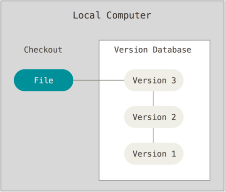
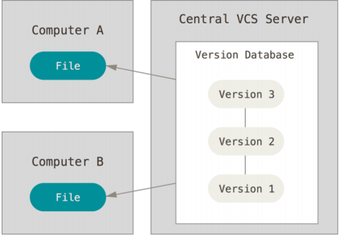
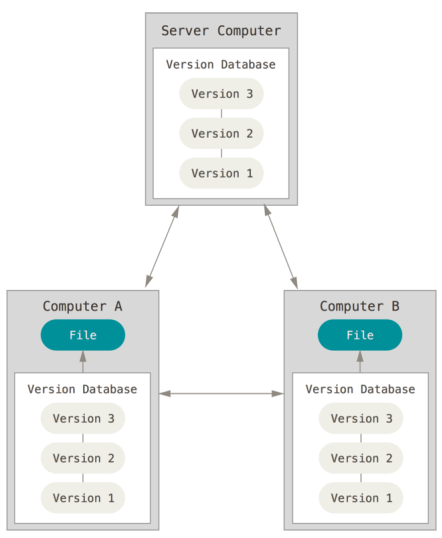
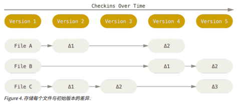
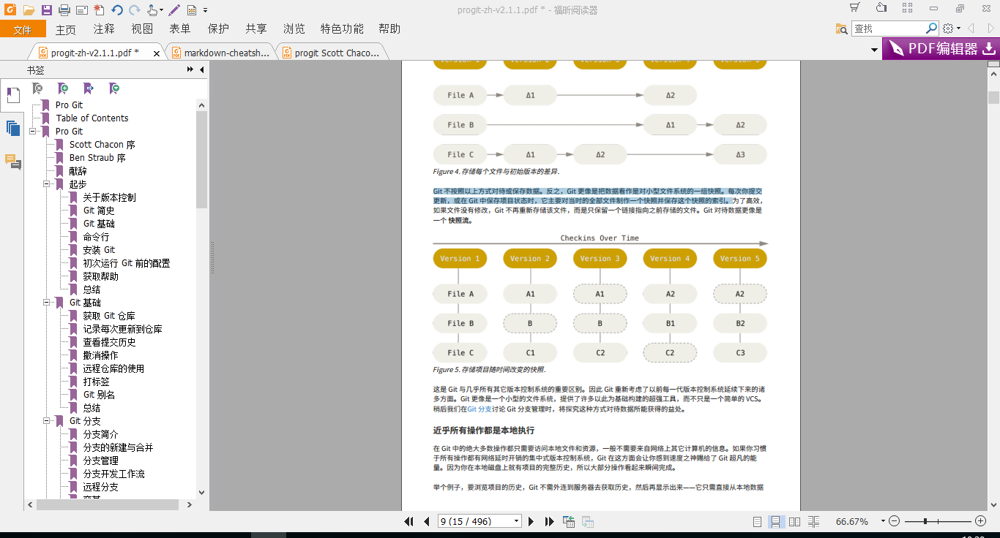
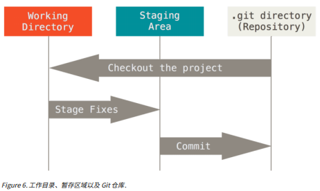
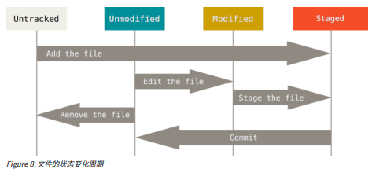

Pro Git 2rd by Scott Chacon and Ben Straub

## 总结

2017.07.18 大概的阅读了一遍，了解了git的一些基本用法，大致了解了原理。还需要在实际的使用过程中继续学习与练习，需要复习的时候，可以先阅读更简短的《Gig Magic》一书。

### 全文阅读总结
1. 

1. 起步
   * 版本控制的原理：本地，集中式，分布式
   * Git: 快照，索引，小型文件系统
   * 三种状态：已提交，已修改，已暂存
   * 配置Git: git config 工具的使用
2. Git基础
   * clone命令的使用
   * status, add, commit
   * 查看历史：git log 
   * 远程仓库：git remote, git fetch, git pull, git push
## 起步 

figure 1: local version control 

figure 2: centralized version control

figure 3: distributed version control

客户端并不只提取最新版本的文件快照，而是把代码仓库完整地镜像下来

### Git基础 

**直接记录快照，而非差异比较**

其它大部分系统以文件变更列表的方式存储信息

Git 不按照以上方式对待或保存数据。反之，Git 更像是把数据看作是对小型文件系统的一组快照。每次你提交
更新，或在 Git 中保存项目状态时，它主要对当时的全部文件制作一个快照并保存这个快照的索引。

Git 更像是一个小型的文件系统，提供了许多以此为基础构建的超强工具，而不只是一个简单的 VCS。

#### 近乎所有的操作都是本地执行

由于git保存文件的方式使得，git的操作基本都只需要访问本地文件和资源

#### Git保证文件的完整性

所有数据在储存前都要计算校验和，采用的SHA-1(hash，哈希)

#### Git一般至添加数据

所有git的操作基本都是可逆的

### 三种状态

已提交(committed)，已修改(modified)，已暂存(staged)。已提交表示数据已安全的保存在本地数据库中，已修改表示修改了文件没有提交至数据库，已暂存表示的已修改文件做了标记，使之包含在下一次提交的快照中。

Git仓库目录是git用来保存**元数据**和**对象数据库**的地方，Git中最重要的部分。

工作目录是对某个版本独立提取出来的内容，这下是从Git仓库的压缩目录中提取出来的。

暂存区域是一个文件，保存下次将提交的文件列表信息，一般在git仓库目录中。

### 命令行

### 初次运行Git前的配置

Git自带工具 *git config* 来设置配置变量，这些变量有三个：
1. 系统级：*/etc/gitconfig* 文件：使用参数 *--system*
2. 用户级：*~/.gitconfig* 或 *~/.config/git/config* 文件，使用参数 *--global* 
3. 仓库级：当前仓库Git目录中的 *config* 文件

用户信息设置示例：
>$ git config --global user.name "Xianjun"

>$ git config --global user.email "xianjunyin@foxmail.com"

设置文本编辑器：
>$ git config --global core.editor emacs

查看配置信息(git config \<key>)：
>$ git config --list

获取帮助：
>$ git help \<verb>

>$ git \<verb> help

>$ man git-\<verb>

## Git基础

### 获取Git仓库

初始化，添加和提交：
>$ git init

>$ git add *.c

>$ git add LICENSE

>$ git commit -m 'initial project version'

克隆仓库：
>$ git clone [url] [name]

### 记录每次更新到仓库

文件状态变化示意图：

查看当前文件状态：
>$ git status

*git add* 命令使用文件或目录的路径作为参数

忽略文件：
无需纳入Git管理的文件，创建 *.gitignore* 文件
如：
>$ cat .gitignore

>*.[oa]

>*~

忽略所有以 *.o* 或 *.a* 结尾的文件

忽略所有以~结尾的文件

具体规则参考《Pro Git》等资料

查看已暂存和未暂存的修改：

*git diff* 以及参数 *--cached* 和 *--staged*

提交：
>$ git commit

>$ git commit -m ["commit messages"]

跳过使用暂存区域：

>$ git commit -a 

移除文件：
>$ rm

>$ git rm

>$ git rm --cached 

>$ git rm log/\*.log

>$ git rm /*~

移动文件：
>$ git mv file_from file_to

### 查看提交历史

工具 *git log* ，有若干选项可供选择，查看书籍，示例如下：
>$ git log

>$ git log -p -2

>$ git log --stat

>$ git log --pretty=oneline

>$ git log --pretty=format:"%h - %an, %ar : %s"

>$ git log --pretty=format:"%h %s" --graph

### 撤销操作

>$ git commit -amend

>$ git reset HEAD [file_name]

#### 撤销对文件的修改

>$ git checkout -- [file_name]

### 远程仓库的使用

>$ git clone [url] [local_name]

>$ git remote [options]

#### 添加远程仓库

>$ git remote add \<shortname> \<url>

>$ git fetch \<name>

#### 从远程仓库中抓取与拉取

>$ git fetch [remote-name]

从中拉取你还没有的数据，可以查看或合并，

>$ git pull [remote-name]

自动抓取并合并远程分支到当前分支，*git clone* 自动跟踪克隆的远程仓库的master分支。

#### 推送到远程仓库

>git push [remote-name] [branch-name]

#### 查看远程仓库

>$ git remote show [remote-name]

#### 远程仓库的移除与重命名

>$ git remote rename old_name new_name

>$ git remote rm remote_name

### 打标签

#### 列出标签

>$ git tag [-l 'v1.8.5*']

#### 附注标签

>$ git tag -a \<name> -m 'message'

>$ git show \<name>

#### 清亮标签

>$ git tag \<name>

>$ git show

#### 后期打标签

>$ git log --pretty=oneline

>$ git git tag -a \<name> \<chechsum>

#### 共享标签

>$ git push origin [tagname]

*git push* 并不传送标签至远程仓库服务器上，必须显示推送， 多个参数使用选项 *git push origin --tags*

#### 检出标签
不能真正检出标签，不能像分支一样来回滚动

### Git别名

git不会自动推断你想输入的名称，设置别名的例子：
>$ git config --global alias.co chechout

>$ git config --global alias.br branch 

>$ git config --global alias.ci commit

>$ git config --global alias.st status

