## 第1章 计算机系统漫游

* 计算机系统是由硬件和软件系统组成的
* 编译系统对程序的执行过程
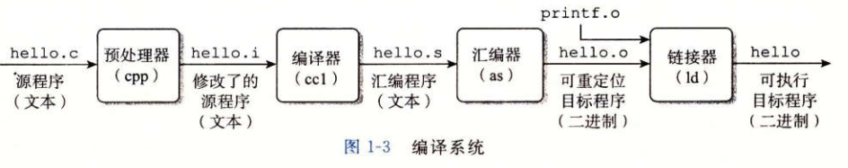

### 1.1 信息就是位+上下文

* C语言的特点：
  * C语言于Unix操作系统关系密切
  * C语言小而简单
  * C语言是为实践目的设计的

### 1.2 程序被其他程序翻译成不同的格式


### 1.3了解编译系统是如何工作的好处

* 优化程序性能：编译器如何优化代码，switch一定比if else高效？while循环比for循环更有效？等等
* 理解链接时出现的错误：最令人困惑的程序错误往往都与链接器操作有关，无法解析引用，命令行上排列库的顺序的影响等等
* 避免安全漏洞：缓冲区溢出错误是造成安全漏洞的主要原因

#### 1.4 处理器读并解释储存在内存中的指令

#### 1.4.1 系统的硬件组成

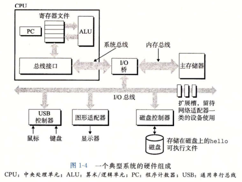

* 总线：一组电子管道，传送定长字节块（字），4个字节（32位）或8个字节（64位）
* I/O设备：如键盘，鼠标，显示器与磁盘（通过控制器/适配器（封装方式不同，前者是系统主板上的芯片组，后者是主板插槽上的卡）与总线相连）
* 主存：
* 处理器：

#### 1.4.2 运行hello程序

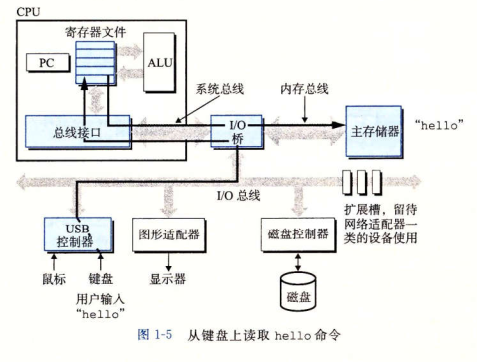

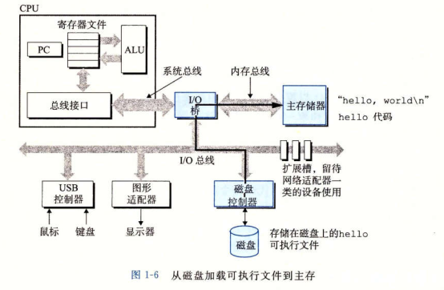

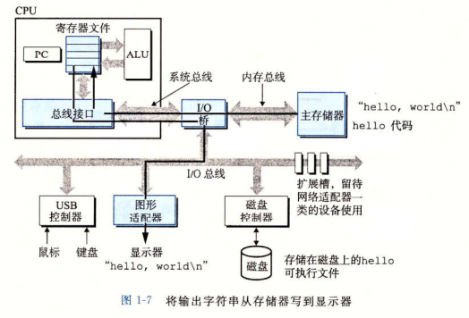

### 1.5 高速缓存至关重要

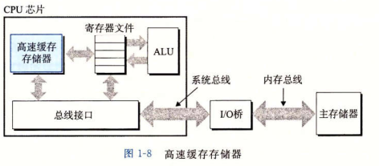

### 1.6 存储设备形成层次结构

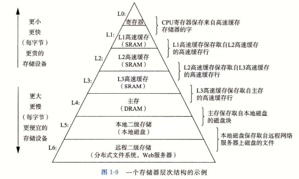

### 1.7 操作系统管理硬件

#### 1.7.1 进程

* 进程是操作系统对一个正在运行的程序的一种抽象。

#### 1.7.2 线程

#### 1.7.3 虚拟内存

#### 1.7.4 文件


* 文件就是字节序列。每个I/O设备，包括磁盘，键盘，显示器，设置网络，都可以看成是文件。

### 1.8 系统之间利用网络通信

网络可视为一个I/O设备

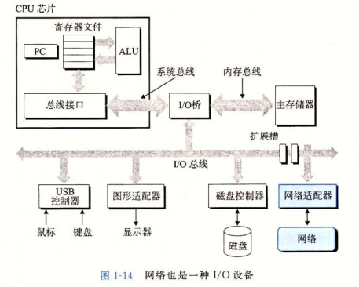

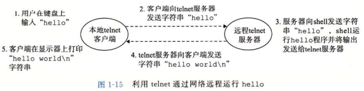

### 1.9 重要主题

#### 1.9.1 Amdahl定律

当我们对系统的某个部分进行加速时，其对系统的整体性能的影响取决于该部分的重要性和加速程度。

#### 1.9.2 并发和并行

* 并发：是指一个同时具有多个活动的系统
* 并行：用并发使一个系统运行得更快

1. 线程级并发

* 超线程，有时称为同时多线程，是一项允许一个CPU执行多个控制流的技术。它涉及CPU某些硬件有多个备份，比如程序计数器和寄存器文件，而其他的硬件部分只有一份，比如执行浮点运算的算术单元

2. 指令级并行

* 同时可以执行多条指令的属性称为指令级并行

3. 单指令，多数据并行

#### 1.9.3 计算机系统中抽象的重要性

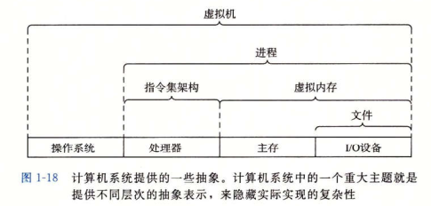


## 第2章 信息的表示和处理

* 三种最重要的数字表示：无符号（unsigned）,补码（two's-complement）,浮点数（floating-point）

## 2.1 信息存储

* C语言的指针，无论它指向一个整数、一个结构体或是某个程序对象，都是某个存储块的第一个字节的虚拟地址
* C中大小固定的数据类型：int32_t, int64_t

### 2.1.1 十六进制表示法

### 2.1.2 字数据大小

### 2.1.3 寻址与字节顺序

* 如果有网络传输的时候，这个是需要考虑的问题
* 大端表示法：最低有效字节在最前面
* 小端表示法：最高有效字节在最前面
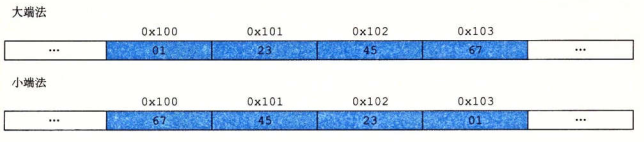
* 如何测试大端系统/小端系统：强制转换或联合体

### 2.1.4 表示字符串

### 2.1.5 表示代码

### 2.1.6 布尔代数简介

### 2.1.7 C语言中的位级运算

* 利用异或运算实现的两个数据的就地交换并没有性能上的优势，只是一个智力游戏：
```C
void inplace_swap(int *x, int *y)
{
  *y = *x ^ *y;
  *x = *x ^ *y;
  *y = *x ^ *y;
}
```
#### 2.1.8 C语言中的逻辑运算

* 如何避免除0操作和引用空指针（利用逻辑运算的特性）
```C
a && 5 / a;
p && *p++;
```

* 不使用等号判断两个数是否相等
```C
!(a ^ b);
```

#### 2.1.9 C语言中的移位运算

* 逻辑右移：用0替代
* 算数右移：用符号位替代
* 移位指定只考虑低log2(w)位，超过了则按照k mod w取余计算

### 2.2 整数表示

#### 2.2.1 整数数据类型

* Java只支持有符号数

#### 2.2.2 无符号数的编码

* 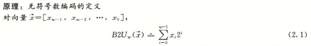
* 以上定义是双射

#### 2.2.3 补码（two's complement）编码

* 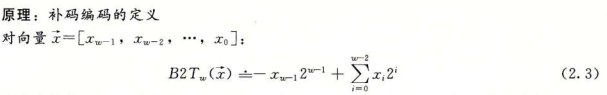
* 以上定义是双射
* 如何计算负数的补码表示：用2**w - x来计算

#### 2.2.4 有符号数和无符号数之间的转换

* 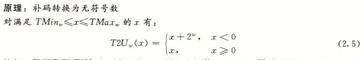
* 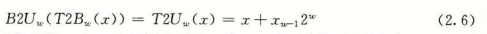

#### 2.2.5 C语言中的有符号数与无符号数

* 会隐式的将有符号转换位无符号数

#### 2.2.6 扩展一个数字的位表示

* 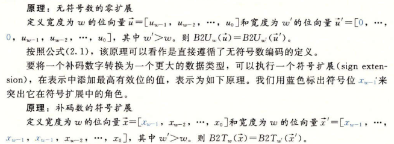

#### 2.2.7 截断数字

* 丢弃高位

#### 2.2.8 关于有符号数与无符号数的建议

* 参考书中的例题，一定要注意有符号无符号，不同长度类型的数据之间的隐士转换带来的问题。
* 早期FreeBSD上一个无符号有符号数之间转换的特性造成的一个漏洞。


### 2.3 整数运算

* 正数加正数却得到了一个负数；x < y 与 x -y < 0的结果却不相同

#### 2.3.1 无符号加法

* 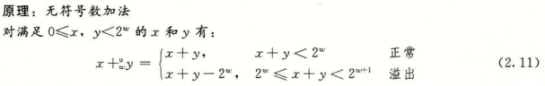
* 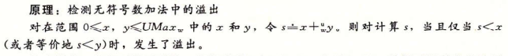
* 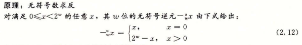

#### 2.3.2 补码加法

* 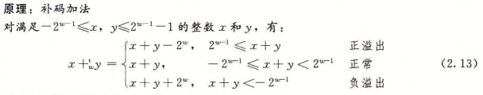
* 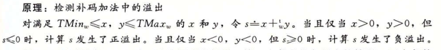

#### 2.3.3 补码的非

* 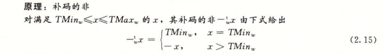
* 求补码非的两种方法：
  * 对每一位求补，再加上1
  * 找到最左边的1，这个1左边的所有位直接取反

#### 2.3.4 无符号乘法

* 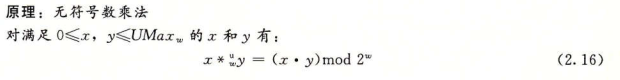

#### 2.3.5 补码乘法

* 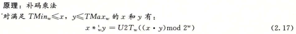

#### 2.3.6 乘以常数

* 乘法指令相当的慢，所有编译器一般会试着用移位和加法运算的组合来代替乘以常数因子的乘法
* 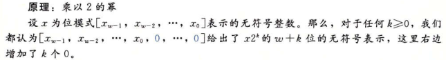
* 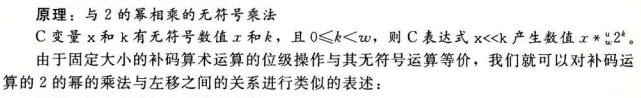
* 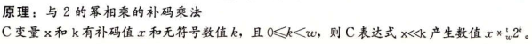
* 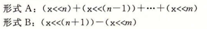


### 2.4 浮点数

#### 2.4.1 二进制小数

#### 2.4.2 IEEE浮点表示

#### 2.4.3 数字示例

#### 2.4.4 舍入

#### 2.4.5 浮点数运算

#### 2.4.6 C语言中的浮点数

## 第3章 程序的机器级表示


#### 第七章 链接

链接（linking）是将各种代码和数据片段收集并组合成为一个单一文件的过程，这个文件可被加载（复制）到内存并执行。

可执行在：编译（compile time），加载（load time），运行（run time）时

功能：分离编译成为可能

**7.1 编译器驱动程序**

静态链接过程：预处理（cpp），编译（ccl），汇编（as），链接（linker）

**7.2 静态链接**

**7.3 目标文件**

三种形式：可重定位目标文件，可执行目标文件，共享目标文件

**7.4 可重定位目标文件**

典型的格式ELF中包含的一些内容：

* .text：已编译程序的机器代码
* .rodata: 只读数据，如printf语句中的格式串和开关语句的跳转表
* .data：已初始化的全局和静态C变量。局部C变量在运行时保存在栈中，既不出现在.data中，也不出现在.bss中
* .bbs：未初始化的全局变量和静态C变量，以及所有被初始化为0的全局变量或静态变量。在目标文件中这个节不占据实际的空间，它仅仅是一个占位符。出现这是为了空间效率，在运行时才分配这些变量，初始值为0.

